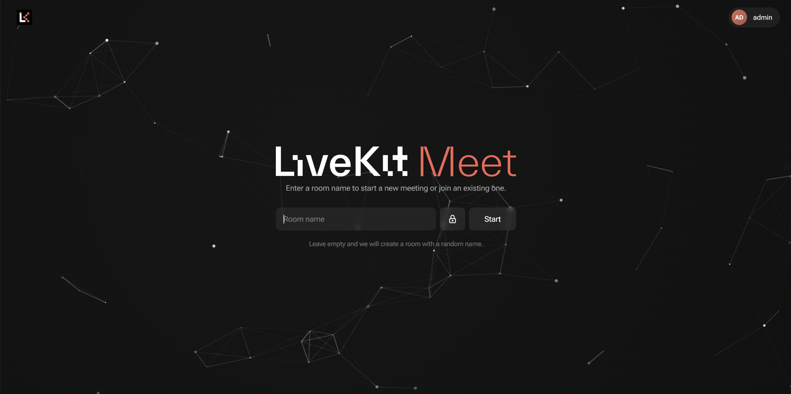

# LiveKit PWA



An unofficial client for [LiveKit Meet](https://github.com/livekit-examples/meet) —
a self-hosted video-conferencing server built as a lighter alternative to Jitsi.
It stands out with a built-in **authentication system**, **moderation system**, and
**lower server resource usage**, which lets you run it even on a weak server.

## Features

- Authentication.
- Ability to invite guests into a room without an account.
- Ability to create password-protected and admin-only rooms.
- Room moderation capabilities.
- Chat with attachment support.
- 6 interface languages, dark theme, PWA (install as an app on your phone).

# Installation

The app needs two mandatory parts: the [**LiveKit media server**](https://github.com/livekit/livekit) (server) and
the **web app** (client).

Additional dependencies are also required for all components to work and to optimize the web interface:
- **livekit-vad** — voice-only transmission (advanced noise suppression)
- **livekit-egress** — the conference recording service
- **Redis** — for caching requests


## Option 1. Docker (recommended)

1. Create the settings file from the template:

   ```bash
   cp .env.example .env
   ```

   In `.env`, set:
   - `LIVEKIT_API_SECRET` — a long random secret (`openssl rand -hex 32`);
   - `AUTH_SECRET` — a random secret for the session cookies (`openssl rand -hex 32`);
   - `LIVEKIT_URL` — the public LiveKit address for the browser (`wss://your-domain`;
     for testing on a single machine — `ws://localhost:7880`).


2. Bring up the set of modules you need via profiles:

   ```bash
   docker compose up -d /     # base: calls, chat, authentication
   --profile vad /            # + voice detection (VAD)
   --profile recording        # + conference recording
   ```

   Profiles can be combined — you can enable some or all of them at once:

   `docker compose --profile recording --profile vad up -d`.


### **Management** — with the usual Compose commands:

```bash
docker compose up -d --build                 # rebuild the web image and start
docker compose restart                       # restart without rebuilding
docker compose pull && docker compose up -d  # update images from the registry
```

## Option 2. Native installation

Requires Node.js ≥ 18 and pnpm, as well as a pre-installed LiveKit server.

```bash
pnpm install
pnpm build
pnpm start
```

Settings are read from `.env.local` in the project root; the template is in the `.env.example` file.
```bash
   cp .env.example .env.local
```
For it to work correctly, don't forget to start the [LiveKit](https://github.com/livekit/livekit) server.
